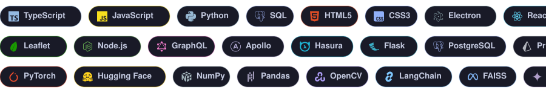
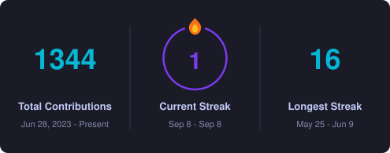
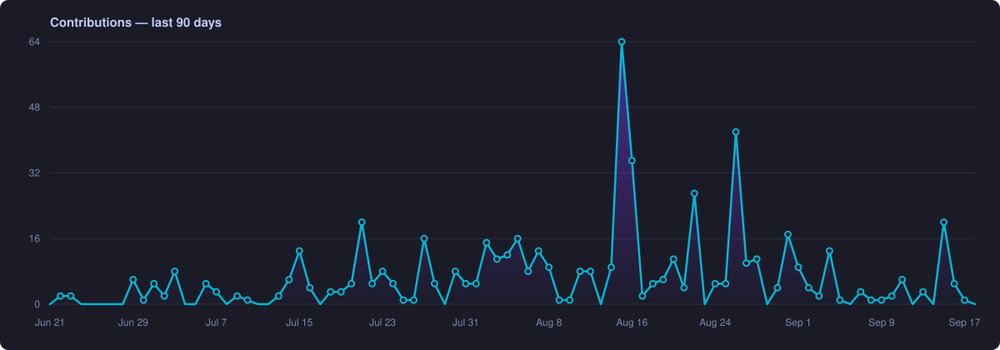
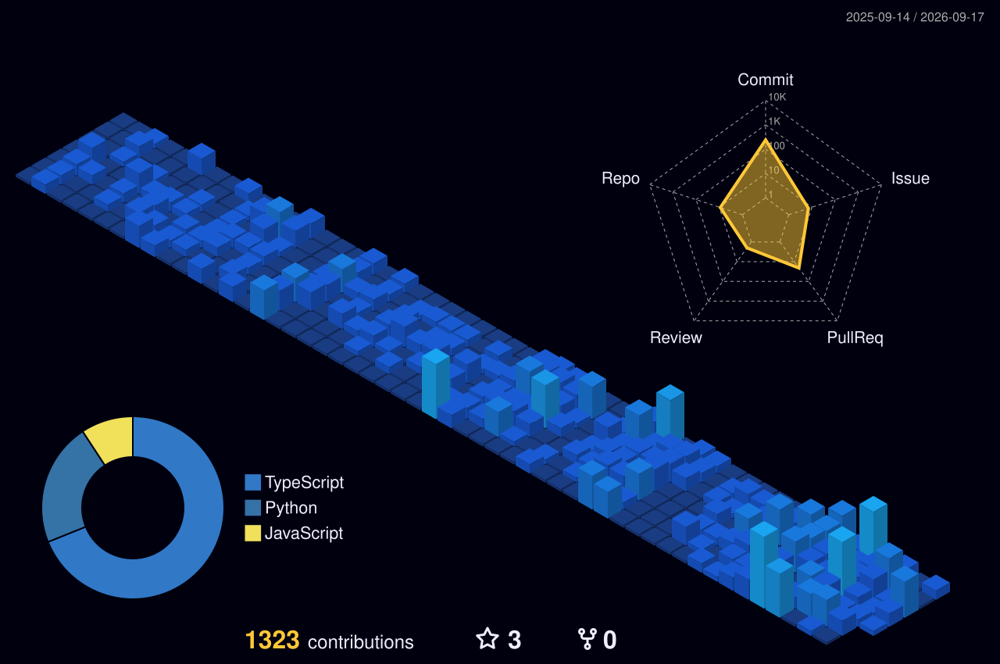

## About Me

- **I love working on** — deep learning and generative AI, usually by rebuilding things from scratch until I actually understand them. Language models, retrieval, and desktop apps that feel fast.
- **I am right now** — an Associate Software Developer at [Talview](https://www.talview.com/), building desktop applications with Electron, React and TypeScript. On the side I'm building NOVA, a hotkey-summonable AI assistant that runs desktop automations on demand.
- **I am open to** — collaborating on GenAI and open-source tooling, and talking about Electron, React, Python, Agentic AI, RAG, automation and more.

## Tech Stack

  

## Activity

<table>
  <tr>
    <td width="47%" valign="middle">
      
    </td>
    <td width="53%" valign="middle">
      
    </td>
  </tr>
  <tr>
    <td colspan="2">
      
    </td>
  </tr>
</table>

## Socials

